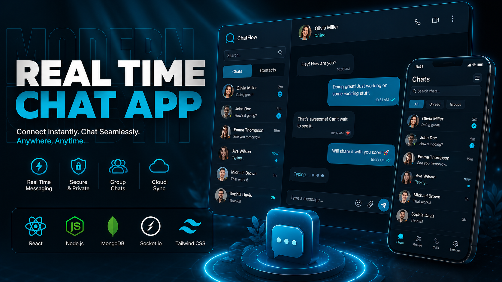

# Full-Stack Chat App

A modern real-time chat application with authentication, protected routes, welcome emails, profile image uploads, and a polished React-based interface.



   

## Description

This project is a full-stack messaging app built with Node.js, Express, MongoDB, Socket.io, and React. It provides a simple way to sign up, log in, exchange messages in real time, update a profile picture, and receive automated welcome emails. The application is designed as a practical example of a production-style chat platform with authentication, rate limiting, and cloud-based media uploads.

## Key Features

- User authentication with JWTs and protected API routes
- Real-time messaging with Socket.io
- Profile picture upload and updates via Cloudinary
- Welcome email delivery on signup using Resend
- Rate-limited API routes with Arcjet
- Clean frontend experience built with React, Tailwind CSS, and DaisyUI
- Persistent storage with MongoDB

## Tech Stack

### Frontend
- React 19
- Vite
- Tailwind CSS
- DaisyUI
- Zustand
- Socket.io Client
- React Hot Toast

### Backend
- Node.js
- Express
- Socket.io
- JWT-based authentication
- Mongoose
- Cookie-based session handling

### Database & Services
- MongoDB
- Cloudinary
- Resend
- Arcjet

### Tools
- ESLint
- Nodemon
- PostCSS
- Autoprefixer

## Project Structure

```text
full_stack_chat_app/
├── backend/
│   ├── src/
│   │   ├── controllers/     # Auth and message logic
│   │   ├── emails/          # Email templates and handlers
│   │   ├── lib/             # Shared helpers, DB, env, socket, Cloudinary
│   │   ├── middleware/      # Auth and protection middleware
│   │   ├── models/          # Mongoose models for users and messages
│   │   └── routes/          # API route definitions
│   └── package.json
├── frontend/
│   ├── public/              # Static assets and demo images
│   ├── src/
│   │   ├── components/      # Reusable UI components
│   │   ├── pages/           # Login, signup, and chat pages
│   │   ├── store/           # Zustand stores
│   │   └── lib/             # Shared frontend utilities
│   └── package.json
└── package.json
```

## Prerequisites

Make sure the following are installed and available:

- Node.js 20 or newer
- npm
- MongoDB instance or MongoDB Atlas connection string
- Cloudinary account
- Resend account and API key
- Arcjet account and API key

## Installation

1. Clone the repository:

```bash
git clone <repository-url>
cd full_stack_chat_app
```

2. Install backend dependencies:

```bash
cd backend
npm install
```

3. Install frontend dependencies:

```bash
cd ../frontend
npm install
```

## Configuration

Create environment files for the backend before running the app.

| Name | Description | Default |
| --- | --- | --- |
| PORT | Port for the backend server | 3000 |
| MONGO_URI | MongoDB connection string | None |
| NODE_ENV | Runtime environment | development |
| JWT_SECRET | Secret used to sign JWT tokens | None |
| CLIENT_URL | Frontend origin used by CORS and Socket.io | http://localhost:5173 |
| RESEND_API_KEY | API key for welcome email delivery | None |
| EMAIL_FROM | Sender email address for Resend | None |
| EMAIL_FROM_NAME | Sender display name for Resend | None |
| CLOUDINARY_CLOUD_NAME | Cloudinary cloud name | None |
| CLOUDINARY_API_KEY | Cloudinary API key | None |
| CLOUDINARY_API_SECRET | Cloudinary API secret | None |
| ARCJET_KEY | Arcjet API key for bot protection and rate limiting | None |
| ARCJET_ENV | Arcjet environment mode | development |

Example backend environment file:

```env
PORT=3000
MONGO_URI=your_mongo_uri_here
NODE_ENV=development
JWT_SECRET=your_jwt_secret
CLIENT_URL=http://localhost:5173
RESEND_API_KEY=your_resend_api_key
EMAIL_FROM=your_email_from_address
EMAIL_FROM_NAME=your_email_from_name
CLOUDINARY_CLOUD_NAME=your_cloudinary_cloud_name
CLOUDINARY_API_KEY=your_cloudinary_api_key
CLOUDINARY_API_SECRET=your_cloudinary_api_secret
ARCJET_KEY=your_arcjet_key
ARCJET_ENV=development
```

## Usage / Quick Start

Start the backend:

```bash
cd backend
npm run dev
```

Start the frontend in a second terminal:

```bash
cd frontend
npm run dev
```

Then open http://localhost:5173 in your browser and sign up or log in to start chatting.

## API Reference

The backend exposes the following main routes:

| Method | Route | Description |
| --- | --- | --- |
| POST | /api/auth/signup | Create a new user account |
| POST | /api/auth/login | Log in a user |
| POST | /api/auth/logout | Log out the current user |
| PUT | /api/auth/update-profile | Update the current user profile |
| GET | /api/messages/contacts | Get available contacts |
| GET | /api/messages/chats | Get chat partners |
| GET | /api/messages/:id | Get messages with a specific user |
| POST | /api/messages/send/:id | Send a message to a user |

## Screenshots / Demo

A sample screenshot is included in the repository at [frontend/public/screenshot-for-readme.png](frontend/public/social_prev.png).

## Contributing

Contributions are welcome. If you would like to improve the project, please open an issue or submit a pull request with a clear description of the change you are proposing.

## License

This project is licensed under the ISC License.

## Contact / Acknowledgements

For questions, feedback, or improvements, please open an issue in the repository.

Acknowledgements include React, Express, MongoDB, Socket.io, Tailwind CSS, DaisyUI, Cloudinary, Resend, and Arcjet.
